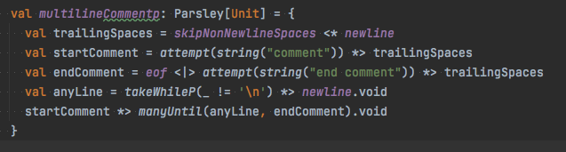
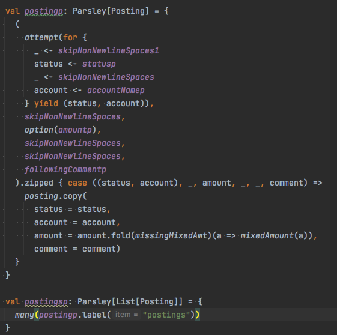
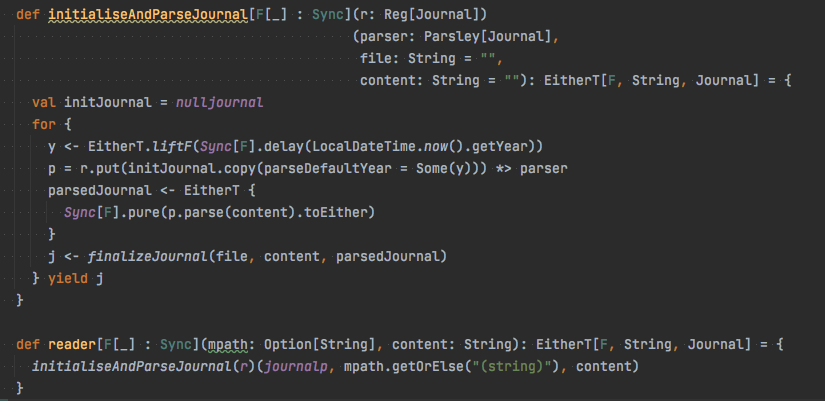

# sledger
sledger is lightweight multi-currency, double-entry accounting software. Allows you to track your money in a plain-text data format.

Example of a journal file:
```journal
2022-01-01 opening balances are declared this way
    assets:checking          $1000  ; Account names can be anything. lower case is easy to type.
    assets:savings           $1000  ; assets, liabilities, equity, revenues, expenses are common.
    assets:cash:wallet        $100  ; : indicates subaccounts.
    liabilities:credit card  $-200  ; liabilities, equity, revenues balances are usually negative.
    equity                          ; One amount can be left blank; $-1900 is inferred here.

2022-04-15 * (#12345) pay taxes
    ; There can be a ! or * after the date meaning "pending" or "cleared".
    ; There can be a transaction code (text in parentheses) after the date/status.
    ; Amounts' sign represents direction of flow, or credit/debit:
    assets:checking          $-500  ; minus means removed from this account (credit)
    expenses:tax:us:2021      $500  ; plus  means added to this account (debit)
                                    ; revenue/expense categories are also "accounts"

```

## Tech stack
- cats
- cats-effect
- Parsley
- decline
- decline-effect
- fansi
- jline3

## Testing
- munit

## Project structure
- A reusable library with core functionality ```sledger-lib```
- A Command Line Interface ```sledger-cli```

### Used GraalVM to build Native Image for convinience usage

### Some interesting parts


### Journal Reader

